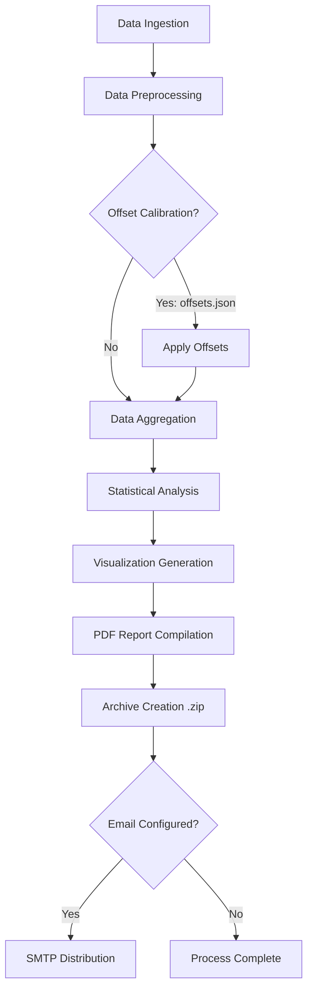

<div align="center">

# NIWE Data Analysis & Visualization Automation

[](https://www.python.org/downloads/)
[](https://pandas.pydata.org/)
[](https://matplotlib.org/)
[](https://pyfpdf.github.io/fpdf2/)
[](LICENSE)

A highly automated, enterprise-grade Python pipeline designed for Exploratory Data Analysis (EDA) and visualization of wind mast measurement data. 

This system systematically parses raw CSV data across multiple observation sites, performs statistical data cleaning, applies configuration-driven calibration offsets, generates comprehensive analytical visualizations, and compiles the outcomes into distributable PDF reports.

</div>

---

## Architecture & Workflow

The system is designed as an end-to-end processing pipeline. Below is the architectural flow of how the script handles data from ingestion to distribution.



### 1. Data Ingestion & Discovery
The script dynamically traverses the specified root directory (defaulting to `Main IP/`). It isolates discrete site folders and ingests the localized CSV datasets, structuring them into Pandas DataFrames. It is capable of parsing complex column naming conventions tied to various mast heights (ranging from 10m to 150m).

### 2. Processing & Calibration
During the data cleaning phase, missing values and anomalies are filtered. The pipeline then evaluates the site directory for an `offsets.json` configuration file. If detected, it applies strict mathematical calibration offsets to both the Wind Speed and Wind Direction series to ensure absolute data fidelity before further analysis.

### 3. Analytics & Visualization Engine
Utilizing Matplotlib, NumPy, and SciPy, the pipeline conducts rigorous analysis to output the following high-resolution assets:
- **Time Series Analysis**: Granular wind speed and direction trends mapped over temporal axes.
- **Diurnal Profiles**: Hourly wind profile averages computed to identify intraday variance.
- **Shear Profiles**: Vertical wind profile extrapolation utilizing the power-law formulation to assess height-dependent velocity scaling.
- **Wind Roses**: Directional frequency distributions cross-referenced with velocity bins.
- **Statistical Correlation**: Multi-height scatter plots and correlation matrices to analyze sensor parity and validation.

### 4. Compilation & Distribution
The graphical outputs are injected into a structured PDF document (`fpdf`). The raw images and PDF report are subsequently compressed into a deployable ZIP archive. If an `email_config.json` payload is present and the `--email` flag is invoked, the archive is transmitted via authenticated SMTP to stakeholders.

---

## System Requirements

The script relies on standard Python numerical and scientific computing libraries.

### Software Dependencies
- **Python**: 3.8 or higher.
- **Pandas**: Core data structures and temporal parsing.
- **NumPy**: Matrix operations and statistical calculations.
- **SciPy**: Advanced statistical modeling (e.g., correlations, regressions).
- **Matplotlib**: Core rendering engine for all vector and raster graphics.
- **FPDF**: PDF document rendering capability.

*All dependencies are strictly declared within the `requirements.txt` file.*

---

## Installation Guide

It is highly recommended to isolate the project environment utilizing `venv` or `conda` prior to installation.

```bash
# 1. Clone the repository
git clone https://github.com/your-org/NIWE-Visualization.git
cd NIWE-Visualization

# 2. Create a virtual environment (optional but recommended)
python3 -m venv venv
source venv/bin/activate  # On Windows use `venv\Scripts\activate`

# 3. Install required dependencies
pip install -r requirements.txt
```

---

## Operational Usage

The primary execution script is `generate_eda.py`. It accepts command-line arguments to modify runtime behavior.

### Standard Execution
To execute the pipeline against the default `Main IP/` directory:
```bash
python3 generate_eda.py
```

### Custom Data Target
To execute the pipeline against a non-standard data directory:
```bash
python3 generate_eda.py --data-dir /absolute/or/relative/path/to/data
```

### SMTP Distribution Execution
To trigger the automated email dispatch upon process completion:
```bash
python3 generate_eda.py --email
```
*(Note: Requires a valid `email_config.json` in the root directory).*

---

## Configuration Specifications

### 1. SMTP Credentials (`email_config.json`)
To enable the network distribution feature, this file must exist in the root directory. The schema requires valid SMTP credentials.

```json
{
    "smtp_server": "smtp.domain.com",
    "smtp_port": 587,
    "sender_email": "service@domain.com",
    "sender_password": "secure_app_password",
    "recipients": [
        "stakeholder_one@domain.com",
        "stakeholder_two@domain.com"
    ]
}
```

### 2. Sensor Calibration (`offsets.json`)
To manually adjust raw sensor telemetry, place this file inside the specific site's data directory. The engine will parse and apply the specific offsets based on key mapping.

```json
{
    "WindSpeed_150m": 0.25,
    "WindDirection_100m": -1.5
}
```

---

## Output Architecture

For every site processed, the system guarantees the creation of an isolated output directory (e.g., `Site_Name_Output/`).

| Artifact Type | Description |
| :--- | :--- |
| **High-Resolution PNGs** | Uncompressed graphical outputs for external presentation usage. |
| **PDF Report** | Synthesized document aggregating all text analysis and graphical representations. |
| **Archive (.zip)** | A fully encapsulated payload of the above components, staged for local storage or remote transmission. |

---

## License

This project is licensed under the **MIT License**. See the [LICENSE](LICENSE) file for more details.
